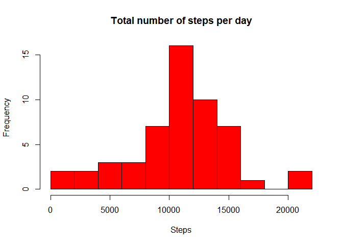
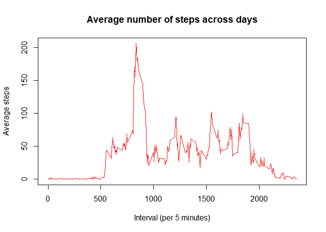
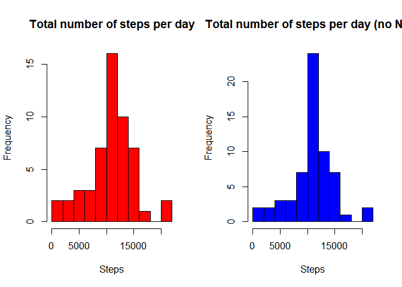

## Loading and preprocessing the data


```r
actdata <- read.csv(unz("activity.zip", "activity.csv"))
```

## What is mean total number of steps taken per day?

First, we'll calculate the total number of steps taken per day.


```r
tot_steps_pd <- aggregate(steps ~ date, actdata, sum)
```

Here's a histogram of the total number of steps per day.


```r
hist(tot_steps_pd$steps, main = "Total number of steps per day", xlab = "Steps", col = "red", breaks = 10)
```

<!-- -->

Let's calculate the mean and median steps per day.


```r
mean(tot_steps_pd$steps)
```

```
## [1] 10766.19
```

```r
median(tot_steps_pd$steps)
```

```
## [1] 10765
```

## What is the average daily activity pattern?

Here's a time series plot of the 5-minute interval (x-axis) and the average number of steps taken, averaged across all days (y-axis):


```r
MstepsInt <- aggregate(steps ~ interval, actdata, mean)
plot(MstepsInt$interval, MstepsInt$steps, type="l", main = "Average number of steps across days", xlab = "Interval (per 5 minutes)", ylab = "Average steps", col = "red")
```

<!-- -->

Which 5-minute interval, on average across all the days in the dataset, contains the maximum number of steps?


```r
MstepsInt$interval[which.max(MstepsInt$steps)]
```

```
## [1] 835
```

## Imputing missing values

This is the total number of missing values in the dataset (number of rows with NA):


```r
nrow(actdata[is.na(actdata$steps),])
```

```
## [1] 2304
```

First, we write a function to get the mean number of steps for an interval.


```r
stepsperInt <- function(interval){
        MstepsInt[MstepsInt$interval==interval,]$steps
}
```

Now we can make a new dataset, where we replace all missing values with the mean number of steps for that interval.


```r
NEWactdata <- actdata          
for(i in 1:nrow(NEWactdata)){
        if(is.na(NEWactdata[i,]$steps)){
                NEWactdata[i,]$steps <- stepsperInt(NEWactdata[i,]$interval)
        }
}
```

Again, we calculate the total number of steps per day and plot a histogram:


```r
tot_steps_pd2 <- aggregate(steps ~ date, NEWactdata, sum)

hist(tot_steps_pd2$steps, main = "Total number of steps per day (no NAs)", xlab = "Steps", col = "blue", breaks = 10)
```

<!-- -->

And we calculate the mean and median again:


```r
mean(tot_steps_pd2$steps)
```

```
## [1] 10766.19
```

```r
median(tot_steps_pd2$steps)
```

```
## [1] 10766.19
```

This time, the mean and median are almost exactly the same.
In addition, if we compare the two histograms below, you can see that the frequency of mean values is much higher in the dataset (in blue on the right) where we filled in missing values with mean values per interval.


```r
par(mfrow=c(1,2))
hist(tot_steps_pd$steps, main = "Total number of steps per day", xlab = "Steps", col = "red", breaks = 10)
hist(tot_steps_pd2$steps, main = "Total number of steps per day (no NAs)", xlab = "Steps", col = "blue", breaks = 10)
```

<!-- -->

## Are there differences in activity patterns between weekdays and weekends?

First, we create a new variable in the dataset with two levels - "weekday" and "weekend" indicating whether a given date is a weekday or weekend day.


```r
NEWactdata$day <- as.POSIXlt(NEWactdata$date)$wday
NEWactdata$dayType <- as.factor(ifelse(NEWactdata$day == 0 | NEWactdata$day == 6, "weekend", "weekday"))
NEWactdata <- subset(NEWactdata, select = -c(day))
```

Finally, here's a panel plot containing a time series plot of the 5-minute interval (x-axis) and the average number of steps taken, averaged across all weekday days or weekend days (y-axis).


```r
days <- NEWactdata[NEWactdata$dayType == "weekday",]
weekends <- NEWactdata[NEWactdata$dayType == "weekend",]
stepsperdays <- aggregate(steps ~ interval, days, mean)
stepsperweekends <- aggregate(steps ~ interval, weekends, mean)

par(mfrow = c(2, 1))
plot(stepsperdays, type = "l", main = "Mean number of steps during weekdays", xlab = "Interval (per 5 minutes)", col = "red")
plot(stepsperweekends, type = "l", main = "Mean number of steps during weekends", xlab = "Interval (per 5 minutes)", col = "blue")
```

<!-- -->
